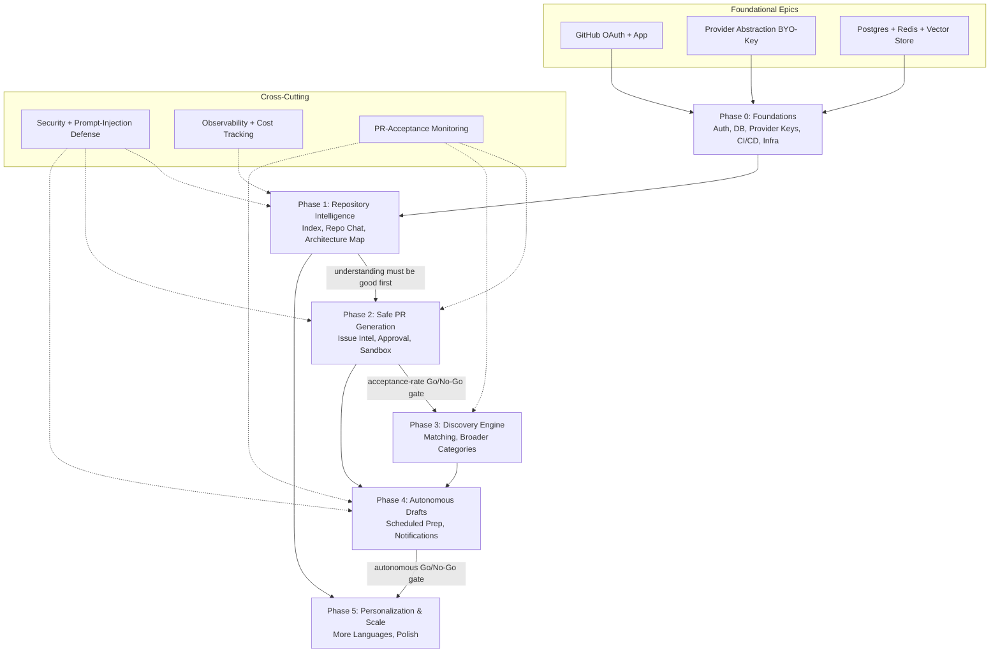

# OpenSource AI Engineer — Development Roadmap

| | |
|---|---|
| **Product** | OpenSource AI Engineer |
| **Document** | Development Roadmap |
| **Version** | 0.1 |
| **Date** | 2026-07-15 |
| **Status** | Draft |
| **Owner** | Founding team |

> **One-line product definition:** An AI platform that understands any GitHub repository, discovers contribution opportunities, and generates high-quality pull requests — under **mandatory human approval, forever**.

---

## 1. Guiding Principles for Sequencing

These principles are the tie-breakers whenever a scope or ordering decision is unclear. When in doubt, re-read this section before adding scope.

1. **Ship the wedge first.** The product surface is enormous (9 feature areas). We do not build breadth; we build one genuinely excellent capability — *repository understanding* — and get real users on it before anything else. Sequencing discipline is our #1 success factor.
2. **Quality gates before scale.** The single biggest existential risk is low-quality auto-generated PRs getting our GitHub App flagged as spam. Therefore: PR generation ships **only after** the understanding layer is demonstrably good; it starts with the **safest categories** (docs, typos, tests, tightly-scoped bugs); every PR is **confidence-gated**; and we advance categories only when acceptance-rate metrics justify it.
3. **BYO-key from day 1.** Users bring their own AI provider (Gemini / OpenAI / Anthropic / OpenRouter / Ollama / Groq / Together). The platform pays **zero inference cost**. The provider abstraction is foundational, not a later add-on.
4. **Human-in-the-loop, always.** No PR is ever opened, published, or merged without an explicit human approval action. "Autonomous mode" prepares **drafts only** — it never auto-publishes. This is a permanent product invariant, not a phase.
5. **Constrain "any repo" early.** v1 supports **Python + TypeScript only** and **caps repository size**. "Any repo, any language" is an aspiration we earn, not a launch promise.
6. **Free-first infra.** Default to free tiers (Vercel / Fly.io / Railway / Render / Supabase / Neon). Cost-to-serve per user must trend toward ~zero because we don't pay for inference.

---

## 2. Phase Overview

| Phase | Theme | Goal | Rough Duration | Key Deliverable |
|---|---|---|---|---|
| **0** | Foundations | Stand up the skeleton: auth, DB, provider keys, infra, CI/CD | ~3–4 weeks | Deployed app shell with GitHub login + BYO-key wiring |
| **1** | **MVP Wedge — Repository Intelligence** | Understand a repo deeply; chat with it; visualize architecture (Python/TS only) | ~6–9 weeks | Users can index a capped Python/TS repo, chat with grounded answers, see an architecture map |
| **2** | Safe PR Generation | Issue intelligence + human-approved PRs for SAFE categories, sandboxed tests | ~6–8 weeks | End-to-end: issue → proposed patch → sandboxed test run → human approval → PR |
| **3** | Discovery Engine | Find good issues across OSS; match to user skills; broaden PR categories | ~5–7 weeks | Personalized issue discovery feed + expanded (still confidence-gated) PR categories |
| **4** | Autonomous Contribution (drafts) | Scheduled draft preparation + notifications — never auto-publish | ~4–6 weeks | Background workers prepare PR drafts on a schedule; user reviews and one-click approves |
| **5** | Personalization & Scale | Personalization engine, more languages, scale hardening, polish | ~6–8 weeks | Multi-language support, personalized ranking, production-grade scale |

*Durations assume a small team (see §8) and are **estimates**, not commitments.*

---

## 3. Phase Details

### Phase 0 — Foundations

**Goal:** A deployable, secure skeleton that a developer can log into with GitHub, register an AI provider key, and that we can ship to continuously. No product value yet — just a trustworthy base.

#### Workstreams / Epics

**Frontend (Next.js / React / TS / Tailwind)**
- [ ] App shell, layout, routing, design tokens, dark mode
- [ ] GitHub OAuth login flow + session handling
- [ ] Provider-key management UI (add / validate / rotate / delete keys per provider)
- [ ] Empty-state dashboard ("connect a repo") placeholder

**Backend (FastAPI / Python)**
- [ ] Service scaffolding, config management, health checks
- [ ] GitHub OAuth token exchange + secure storage
- [ ] Provider abstraction layer v1: unified interface across Gemini / OpenAI / Anthropic / OpenRouter / Ollama / Groq / Together (chat + embeddings)
- [ ] Encrypted secrets storage for provider keys (envelope encryption; never log key material)
- [ ] Rate-limit-aware GitHub REST/GraphQL client wrapper

**GitHub App**
- [ ] Register GitHub App (permissions: read repo contents/metadata/issues; PR write deferred to Phase 2)
- [ ] Webhook receiver endpoint (signature verification) — stubbed handlers
- [ ] OAuth vs App-installation token strategy documented

**Data / Infra**
- [ ] Postgres schema v1: users, orgs, provider_keys, repos, sessions, audit_log
- [ ] Redis for cache/queues
- [ ] Choose + provision vector store (ChromaDB or Qdrant) — decision recorded
- [ ] IaC / environment config for Vercel (web) + Fly.io/Railway/Render (backend) + Supabase/Neon (Postgres)
- [ ] CI/CD: lint, typecheck, test, preview deploys, secret scanning
- [ ] Observability baseline: structured logging, error tracking, request tracing

#### Exit Criteria / Definition of Done
- A new user can: log in with GitHub → add and validate a provider key → see an (empty) dashboard.
- Provider abstraction can complete a trivial chat + embedding call against **at least 3** providers using a user-supplied key.
- CI/CD green; preview deploys on PRs; production deploy documented and reproducible.
- Secrets are encrypted at rest; no key material in logs (verified).

#### Key Metrics
- Login success rate; provider-key validation success rate; deploy frequency; CI pass rate.

#### Phase-Specific Risks
- **Provider abstraction sprawl** — each provider has quirks (embeddings dims, streaming, tool formats). Mitigate: define a minimal common interface now; defer advanced features.
- **Secrets handling done wrong** is unrecoverable trust damage. Mitigate: encryption + secret-scanning in CI from day one.

---

### Phase 1 — MVP Wedge: Repository Intelligence *(the core value)*

**Goal:** A user connects a **Python or TypeScript** repo (size-capped), and within minutes gets: (a) a grounded **Repo Chat**, and (b) an **Architecture Map**. This is the product's reason to exist. Ship it, get users, and do not move on until it is genuinely good.

#### Workstreams / Epics

**AI / Agents**
- [ ] Ingestion pipeline: clone (size-capped) → parse with Tree-sitter (Python + TS grammars) → chunk by symbol/semantic boundaries
- [ ] Symbol graph: functions, classes, imports, call/reference edges (Tree-sitter + optional LSP enrichment)
- [ ] Embedding + indexing into vector store (per-repo namespace); incremental re-index on push
- [ ] Retrieval layer: hybrid (vector + symbol-graph + keyword) with citations back to file/line
- [ ] Repo Chat agent (LangGraph + PydanticAI): grounded answers with mandatory source citations, refusal when unsupported
- [ ] Architecture summarization: module/dependency structure → structured map data

**Frontend**
- [ ] Repo connect + index-progress UI (with cap/eligibility messaging)
- [ ] Repo Chat interface with inline citations and file previews
- [ ] Architecture Map visualization (module/dependency graph, drill-down)
- [ ] Repo overview page (languages, size, structure, entry points)

**Backend**
- [ ] Indexing job orchestration (queue, retries, progress events)
- [ ] Repo eligibility checks (language allow-list, size cap, license read)
- [ ] Chat session storage + per-repo context management
- [ ] Cost/token accounting per user (their key, but we surface usage)

**GitHub App**
- [ ] Repo content read at scale (respecting rate limits, ETags, conditional requests)
- [ ] Push webhook → incremental re-index trigger

**Infra**
- [ ] Vector store scaling plan for capped repos; storage budgeting
- [ ] Index caching + dedupe of identical files across repos

#### Task Breakdown (representative)
- [ ] Tree-sitter parsing for `.py`, `.ts`, `.tsx` with graceful fallback on parse errors
- [ ] Chunking strategy tuned + evaluated on a golden set of 10 reference repos
- [ ] Retrieval eval harness: question → expected-source recall/precision
- [ ] Citation-faithfulness checks (does the answer's claim map to a retrieved chunk?)
- [ ] Architecture map correctness spot-checks on known repos

#### Exit Criteria / Definition of Done
- Index a capped Python/TS repo end-to-end with a visible progress UX.
- Repo Chat answers **cite real sources** and refuses/hedges when unsupported (measured on the golden set).
- Architecture Map renders for the reference repos and is judged useful by ≥5 external testers.
- Incremental re-index on push works.

#### Key Metrics
- **Time-to-first-understanding** (connect → first useful answer)
- Retrieval precision/recall on golden set; citation-faithfulness rate
- Chat sessions per user; repos indexed; week-1 retention

#### Phase-Specific Risks
- **"Genuinely good" is subjective** — without an eval harness we'll ship mediocre understanding. Mitigate: golden-set evals gate the exit.
- **Indexing cost/scale** even without inference costs (storage, compute). Mitigate: hard size cap + dedupe + free-tier budgeting.
- **Scope creep into PR features.** Mitigate: PR work is explicitly out of Phase 1.

---

### Phase 2 — Safe PR Generation *(first time we write to repos)*

**Goal:** Turn understanding into action for the **safest categories only** — docs, typos, tests, and tightly-scoped bugs — with a **full human-approval workflow** and **sandboxed test runs**. This is where the spam/quality risk is highest, so it is heavily gated.

#### Workstreams / Epics

**AI / Agents**
- [ ] Issue intelligence: parse/classify issues, assess scope, flag "safe-category" candidates
- [ ] Patch-generation agent (LangGraph + PydanticAI) constrained to safe categories
- [ ] **Confidence scoring** per proposed patch; below-threshold patches are never surfaced for approval
- [ ] Self-critique / verification pass before a human ever sees the draft

**Backend / Infra**
- [ ] **Sandboxed execution** environment for running the repo's test suite against a patch (isolated, network-restricted, resource-capped)
- [ ] Test-result capture + diff rendering
- [ ] Approval workflow state machine: draft → tests → human review → approved → PR opened

**GitHub App**
- [ ] Request PR-write permission (separate, explicit install upgrade)
- [ ] Open PR **only** after human approval; standardized PR template with disclosure that AI assisted + human approved
- [ ] Link PR back to originating issue

**Frontend**
- [ ] Proposed-change review UI: diff, confidence, test results, rationale, sources
- [ ] Explicit approve / reject / request-changes controls (approve is a deliberate, irreversible-labeled action)
- [ ] Per-repo and per-user PR history + acceptance tracking

#### Task Breakdown
- [ ] Category classifier with precision-first tuning (false "safe" is worse than false "unsafe")
- [ ] Sandbox hardening review (no secret exfiltration, no network abuse)
- [ ] PR-acceptance tracking instrumentation (opened → merged / closed / changes-requested)
- [ ] Prompt-injection defense on issue/repo content (see cross-cutting §6)
- [ ] Dry-run mode: generate + test + score, but do not open PR (for internal validation)

#### Exit Criteria / Definition of Done *(also see Go/No-Go §10)*
- Full loop works in dry-run on internal repos: issue → patch → sandboxed tests pass → human approves → PR opens.
- Confidence gate demonstrably suppresses low-quality patches.
- On a controlled pilot, **PR acceptance rate meets the Go/No-Go threshold** before any public/at-scale enablement.
- No PR is ever opened without a recorded human-approval event (auditable).

#### Key Metrics
- **PR acceptance rate (north star)**; changes-requested rate; sandbox test pass rate
- Confidence-score calibration (predicted vs. actual acceptance)
- % of generated drafts that a human approves

#### Phase-Specific Risks
- **Spam flagging (existential).** Mitigate: safe categories only, confidence gate, mandatory approval, low volume, honest AI-assist disclosure, pilot before scale.
- **Sandbox escape / abuse.** Mitigate: isolation, network egress controls, resource caps, security review.
- **Over-trusting tests** (green tests ≠ correct). Mitigate: human review remains mandatory; self-critique pass.

---

### Phase 3 — Open Source Discovery Engine

**Goal:** Help users *find* worthwhile contributions across OSS, matched to their skills — and cautiously broaden PR categories beyond the initial safe set.

#### Workstreams / Epics

**AI / Agents**
- [ ] Issue discovery + ranking across repos (good-first-issue signals, activity, maintainer responsiveness)
- [ ] Skill/interest matching (from user's languages, prior PRs, stated preferences)
- [ ] Category expansion: introduce the next-safest PR categories **behind the same confidence gate**

**Backend**
- [ ] Crawl/ingest issue metadata at scale within GitHub rate limits (GraphQL batching, caching)
- [ ] Ranking service + feedback loop (thumbs up/down, "not for me")

**Frontend**
- [ ] Personalized discovery feed
- [ ] Issue detail with "understand this repo" one-click into Phase 1 flow
- [ ] Saved / bookmarked opportunities

#### Exit Criteria / DoD
- Discovery feed surfaces relevant issues (measured by click-through + accept-to-attempt rate).
- Newly added PR categories maintain acceptance rate **at or above** the Phase 2 threshold.

#### Key Metrics
- Discovery CTR; opportunity → attempted-contribution conversion; acceptance rate by category.

#### Phase-Specific Risks
- **GitHub rate limits** at crawl scale. Mitigate: GraphQL batching, conditional requests, backoff, per-user token pooling.
- **Category expansion re-introduces spam risk.** Mitigate: expand one category at a time, gated on sustained acceptance metrics.

---

### Phase 4 — Autonomous Contribution Mode *(drafts only)*

**Goal:** Prepare contribution **drafts on a schedule** and notify the user — **never auto-publish**. The human still approves every single PR.

#### Workstreams / Epics

**AI / Agents**
- [ ] Scheduled draft preparation: pick matched issues → generate + sandbox-test → score → stage draft
- [ ] Draft quality gate identical to Phase 2 (confidence + tests + self-critique)

**Backend / Infra**
- [ ] Background scheduler/worker fleet with quotas per user
- [ ] Notification service (in-app + email/webhook) for ready-to-review drafts

**Frontend**
- [ ] Autonomous-mode settings (frequency, repos, categories, hard caps)
- [ ] "Ready for your review" queue with one-click approve/reject
- [ ] Prominent, unmissable "nothing is published without you" messaging

#### Exit Criteria / DoD *(also see Go/No-Go §10)*
- Scheduled drafts are prepared and queued; **zero** are ever published without human approval (auditable invariant).
- Autonomous-prepared drafts meet the same acceptance threshold as manually-triggered ones.

#### Key Metrics
- Draft-prep throughput; draft → approval rate; acceptance rate of autonomous drafts vs. manual.

#### Phase-Specific Risks
- **Silent scaling of low-quality volume.** Mitigate: per-user caps, same confidence gate, and Go/No-Go acceptance gate before enabling.
- **Notification fatigue.** Mitigate: batching, quality-first (only high-confidence drafts queued).

---

### Phase 5 — Personalization Engine & Scale

**Goal:** Personalize ranking/experience, add more languages, harden for scale, and polish.

#### Workstreams / Epics

**AI / Agents**
- [ ] Personalization engine: learn from user's accept/reject history to rank issues, categories, and phrasing
- [ ] Additional language support (e.g., Go, Rust, Java) — each behind its own parsing + eval bar

**Backend / Infra**
- [ ] Scale hardening: sharded indexing, vector-store partitioning, queue autoscaling
- [ ] Cost/usage dashboards (per user, per repo)

**Frontend**
- [ ] Personalized dashboards, onboarding polish, performance/UX refinement
- [ ] Public profile / contribution history

#### Exit Criteria / DoD
- Personalized ranking beats baseline on offline + online metrics.
- At least one additional language passes the same understanding-quality bar as Python/TS.
- Scale targets met without regressing acceptance rate.

#### Key Metrics
- Long-term retention; personalization lift; per-language acceptance rate; cost-to-serve.

#### Phase-Specific Risks
- **Language expansion dilutes quality.** Mitigate: reuse the Phase 1 golden-set eval gate per language.
- **Scale regressions on quality.** Mitigate: acceptance rate is a release gate, not just a dashboard.

---

## 4. Milestones & Suggested Timeline

> All ranges are **estimates** for a small team (see §8), assume some parallelization, and will shift with hiring and learnings.

| Milestone | Target Window (est.) | Marks |
|---|---|---|
| **M0 — Skeleton live** | Weeks 1–4 | Phase 0 done: login + BYO-key + CI/CD |
| **M1 — Understanding beta** | Weeks 5–13 | Phase 1 done: chat + architecture map on Python/TS |
| **M1.5 — Public wedge launch** | ~Week 13 | Onboard external users on the understanding layer |
| **M2 — First approved PRs** | Weeks 14–21 | Phase 2 done: safe-category PRs via approval + sandbox |
| **M2 Gate — PR scale approval** | ~Week 21 | Go/No-Go acceptance threshold met (see §10) |
| **M3 — Discovery live** | Weeks 22–28 | Phase 3 done: discovery + matching + broader categories |
| **M4 — Autonomous drafts** | Weeks 29–34 | Phase 4 done: scheduled drafts, notifications, human approval |
| **M5 — Personalization & scale** | Weeks 35–42 | Phase 5 done: personalization + more languages + polish |

---

## 5. Cross-Cutting Workstreams (span all phases)

| Workstream | Description | Applies |
|---|---|---|
| **Security** | Secrets encryption, dependency scanning, sandbox isolation, least-privilege GitHub scopes, periodic security review | All phases |
| **Prompt-injection defense** | Treat all repo/issue/PR content as untrusted data, not instructions; sanitize, isolate, and constrain agent tools; never let repo content escalate permissions | Phase 1+ (critical in 2–4) |
| **Observability & cost tracking** | Structured logs, tracing, error tracking, per-user token/usage accounting, index storage budgeting | All phases |
| **PR-acceptance-rate monitoring** | Continuous tracking of opened → merged/closed/changes-requested, by category and confidence bucket; feeds Go/No-Go gates | Phase 2+ |
| **Testing** | Unit/integration/e2e; **eval harnesses** for retrieval quality and patch quality (golden sets); sandbox test reliability | All phases |
| **Docs** | User docs, provider-setup guides, contribution-quality guidelines, transparency about AI-assist + human approval | All phases |
| **Rate-limit & abuse management** | GitHub REST/GraphQL rate-limit handling, backoff, token pooling, volume caps to avoid spam signals | Phase 1+ |

---

## 6. Dependency Map



---

## 7. Team & Skills per Phase

| Phase | Core Roles Needed |
|---|---|
| **0** | Full-stack (Next.js/TS), Backend (FastAPI/Python), DevOps/Infra, Security-minded eng |
| **1** | Backend/AI eng (Tree-sitter, LSP, vectors, retrieval), Agent eng (LangGraph/PydanticAI), Frontend (viz/graphs), ML/eval eng (part-time) |
| **2** | Agent eng, Backend (sandboxing/execution security), Frontend (review UX), Security eng, GitHub-App specialist |
| **3** | Backend (data/crawl, ranking), AI eng (matching), Frontend (feed) |
| **4** | Backend (schedulers/workers), Infra (queues/scale), Frontend (settings/queue) |
| **5** | ML eng (personalization), Backend (multi-language parsing), Infra (scale), Design/Frontend (polish) |

*A realistic small team: 2–4 engineers spanning these skills, with fractional design/security. Roles overlap; the table shows where emphasis shifts.*

---

## 8. Success Metrics

### Per Phase
| Phase | Primary Metric(s) |
|---|---|
| 0 | Login success rate; provider-key validation success rate; deploy cadence |
| 1 | **Time-to-first-understanding**; retrieval precision/recall; citation faithfulness; week-1 retention |
| 2 | **PR acceptance rate (north star)**; changes-requested rate; confidence calibration |
| 3 | Discovery CTR; opportunity → attempt conversion; acceptance rate by category |
| 4 | Draft → approval rate; autonomous vs. manual acceptance parity |
| 5 | Long-term retention; personalization lift; per-language acceptance; cost-to-serve |

### Overall (North Star + Health)
- **North Star: PR acceptance rate** (merged / opened) — the truest signal of quality and non-spam.
- **Activation:** % of signups who index a repo and get a useful answer.
- **Time-to-understanding:** connect → first useful, cited answer.
- **Retention:** week-1, week-4, and long-term active users.
- **Trust/safety health:** GitHub App standing (no spam flags), changes-requested rate, human-approval coverage = 100%.

---

## 9. Go / No-Go Gates

Explicit gates that **must pass** before advancing. These are hard stops, not guidelines.

### Gate A — Before enabling PR generation at any real scale (end of Phase 2)
- [ ] Understanding layer passes its golden-set eval bar (retrieval + citation faithfulness).
- [ ] Full approval + sandbox loop works end-to-end with an auditable human-approval event on every PR.
- [ ] Confidence gate demonstrably suppresses low-quality patches.
- [ ] **Pilot PR acceptance rate ≥ target threshold** (recommended starting bar: **≥ 70–80% merged-or-progressing, with < ~15% closed-as-unwanted**) — set the exact number with pilot maintainers before launch.
- [ ] Security review of sandbox + prompt-injection defenses passed.
- [ ] Honest AI-assist + human-approval disclosure present on every PR.

### Gate B — Before enabling Autonomous (draft) Mode (end of Phase 4)
- [ ] Autonomous-prepared drafts meet the **same or better** acceptance threshold as manually-triggered ones.
- [ ] Per-user volume caps enforced; no path can publish without human approval (verified by audit).
- [ ] Notification/queue UX makes "nothing publishes without you" unmissable.
- [ ] Sustained acceptance-rate metrics over a defined observation window (not a single good week).

> If a gate fails, we **do not** advance — we fix understanding/quality first. Volume is never a substitute for quality.

---

## 10. Risk Register

| # | Risk | Phase(s) | Likelihood | Impact | Mitigation |
|---|---|---|---|---|---|
| R1 | Low-quality auto PRs get GitHub App flagged as **spam** (existential) | 2–4 | Medium | Critical | Safe categories only; confidence gate; mandatory human approval; low volume; honest disclosure; acceptance-rate Go/No-Go before scale |
| R2 | **Scope creep** across 9 feature areas dilutes focus | All | High | High | Wedge-first sequencing; PR work barred from Phase 1; guiding principles as tie-breaker |
| R3 | **Indexing cost/scale** (storage, compute) even without inference cost | 1, 5 | Medium | High | Hard repo-size cap; file dedupe; incremental re-index; free-tier budgeting; Python/TS only in v1 |
| R4 | **Provider-abstraction complexity** (embeddings dims, streaming, tool formats differ) | 0, 1 | High | Medium | Minimal common interface first; defer advanced features; per-provider conformance tests |
| R5 | **GitHub rate limits** at crawl/index scale | 1, 3 | High | Medium | GraphQL batching; conditional requests/ETags; backoff; per-user token pooling |
| R6 | Understanding ships "not good enough," undermining the wedge | 1 | Medium | High | Golden-set eval harness gates Phase 1 exit; external tester validation |
| R7 | **Sandbox escape / abuse** during test runs | 2, 4 | Low | Critical | Isolation, network egress controls, resource caps, security review |
| R8 | **Prompt injection** via repo/issue content steering agents | 1–4 | Medium | High | Treat all repo content as untrusted data; tool-permission constraints; no privilege escalation from content |
| R9 | Green tests mistaken for correctness | 2, 4 | Medium | Medium | Human review mandatory; self-critique pass; confidence calibration |
| R10 | Secrets/key mishandling erodes trust | 0+ | Low | Critical | Envelope encryption; no key material in logs; CI secret scanning |
| R11 | Autonomous mode silently scales low-quality volume | 4 | Medium | High | Per-user caps; same confidence gate; Gate B before enabling; drafts-only invariant |

---

## 11. Open Questions

- **Acceptance-rate threshold:** What exact merged/closed ratio defines "safe to scale" at Gate A? (Recommend calibrating with a handful of pilot maintainers.)
- **Repo-size cap:** What are the concrete limits (files, LOC, embedding count) for v1 eligibility?
- **Vector store:** ChromaDB vs. Qdrant — final decision criteria (self-host cost, filtering, scale, free-tier fit)?
- **Maintainer consent:** Should we require/encourage maintainer opt-in before opening AI-assisted PRs on their repos, and how is that surfaced?
- **PR disclosure standard:** Exact wording/format of the AI-assist + human-approval disclosure to stay in good standing with communities and GitHub policy.
- **Free-tier ceilings:** At what usage do we outgrow free hosting/DB tiers, and what's the fallback?
- **Multi-key / org accounts:** How do teams share provider keys and repos without leaking secrets?
- **Handling of failing/absent test suites:** How do we treat safe-category PRs on repos with no or broken CI?
- **Abuse prevention:** How do we stop bad actors from using autonomous mode to mass-generate spam under their own keys?
- **Model variability:** Since users BYO-provider, how do we keep quality consistent across wildly different model capabilities (e.g., Ollama local vs. frontier APIs)?
```
