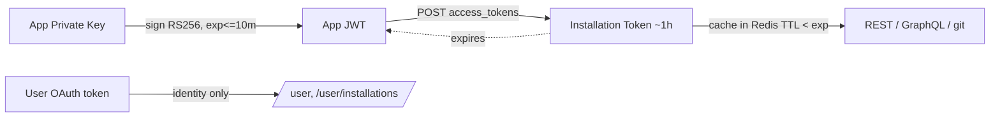
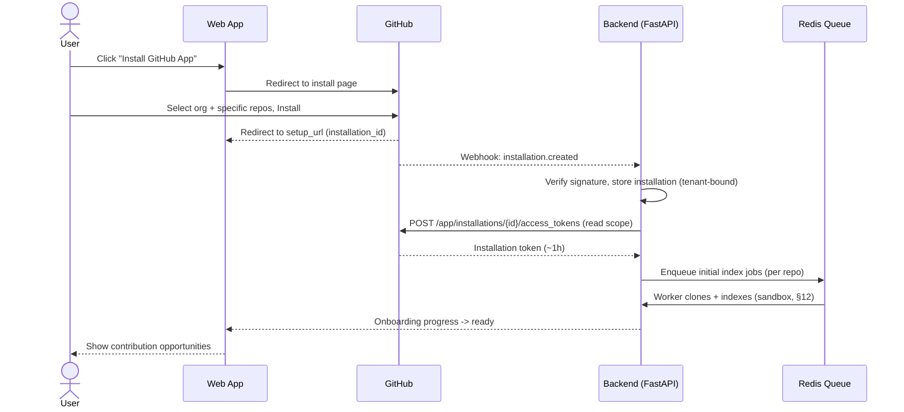
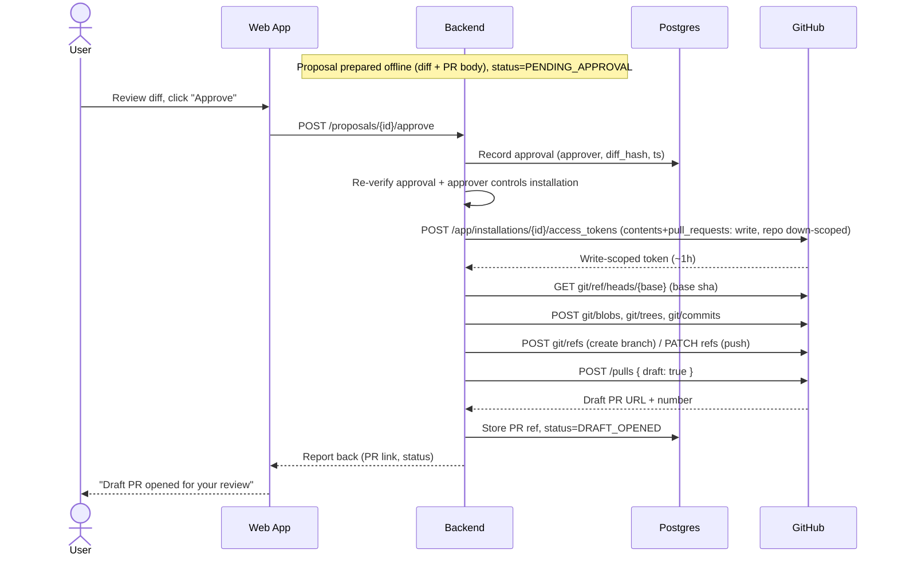

# OpenSource AI Engineer — GitHub App Design Document

| | |
|---|---|
| **Title** | OpenSource AI Engineer — GitHub App Design Document |
| **Version** | 0.1 |
| **Date** | 2026-07-15 |
| **Status** | Draft |
| **Owner** | Platform / Integrations |

---

## 1. Overview & Responsibilities

**OpenSource AI Engineer** is an AI platform that understands GitHub repositories, surfaces contribution opportunities, and prepares high-quality pull requests. Every write action to a user's repositories is gated behind **mandatory, explicit human approval**. The GitHub integration ships as an official **GitHub App** built on top of GitHub's public REST and GraphQL APIs, git data APIs, and webhooks.

### Component responsibilities

| Concern | GitHub App (this document) | Web App / Backend |
|---|---|---|
| Repository access grant | Receives installation, holds installation-scoped tokens | Stores installation records, maps to tenants/users |
| Reading code, issues, PRs, docs | Performs REST/GraphQL/git reads with installation token | Requests reads, orchestrates indexing |
| Receiving repo activity | Delivers webhooks (push, PR, issues, etc.) | Consumes webhook queue, triggers re-index |
| Login / identity | User-to-server OAuth (who is this user) | Session, RBAC, tenant binding |
| Writes (branch/commit/draft PR) | Executes only after backend confirms approval | Owns the approval gate; nothing writes without it |
| Contribution analysis / PR authoring | N/A (no intelligence lives in the App layer) | LLM pipeline, indexing, ranking, diff generation |

The GitHub App is intentionally a **thin, permission-scoped access + eventing layer**. All product intelligence, storage, and the approval gate live in the backend (FastAPI/Python, Postgres + Redis). The App **never** initiates a write on its own; writes are always the result of a backend command that has verified a recorded human approval.

### Product phases (scope wedge)

| Phase | Capability | Write to GitHub? |
|---|---|---|
| **v1** | Read-only understanding: clone repo, read issues/PRs/docs, index (Python/TS repos) | No |
| **v2** | Create branch, push commits, open **DRAFT** PRs — only after explicit user approval | Yes, approval-gated only |
| **v3** | Autonomous **scheduled** draft preparation (still draft, still approval-gated to open) | Yes, approval-gated only |

> **Invariant (all phases):** The app must **NEVER** push commits or open a PR without explicit, per-action user approval recorded in the backend. There is no "auto-submit" mode, ever, including v3.

---

## 2. App Type & Auth Model

The platform uses **three distinct GitHub authentication mechanisms**, each for a different purpose. Conflating them is the most common source of security and scoping errors, so they are separated explicitly.

### 2.1 GitHub App (not OAuth App) for repository access

We register a **GitHub App**, not an OAuth App.

| | GitHub App (chosen) | OAuth App (rejected) |
|---|---|---|
| Access model | Installed per account/org, scoped to **selected repositories** | Acts as the user, gets **all repos the user can see** |
| Permissions | Fine-grained, per-resource (contents, issues, ...) | Coarse OAuth scopes (`repo` = everything) |
| Token | Short-lived **installation access token** (~1h) | Long-lived user OAuth token |
| Rate limits | Per-installation, scales with installed repos | Per-user, shared/global |
| Least privilege | Strong — request only what phase needs | Weak |
| Revocation | Uninstall removes all access cleanly | Token stays until revoked |

A GitHub App gives us per-repository selection, fine-grained permissions, higher and better-isolated rate limits, and clean uninstall semantics — all required for a multi-tenant, least-privilege, approval-gated product.

### 2.2 User-to-server OAuth for login

For **identity only** (who is the logged-in human), the same GitHub App exposes a user-to-server OAuth flow (`GET https://github.com/login/oauth/authorize` → `POST https://github.com/login/oauth/access_token`). This tells us the GitHub identity of the person using the web app so we can:

- bind a person to the installations they administer,
- enforce that the human approving a write actually controls the target installation.

We request **no repository scopes** on the user token. Repository access always comes from the installation token, never the user token. The user token is used for `GET /user` and `GET /user/installations` type calls.

### 2.3 App authentication: JWT signed with the private key

To authenticate **as the App** (for app-level endpoints and to mint installation tokens), the backend creates a short-lived **JWT signed with the App's RSA private key (RS256)**:

- `iss` = App ID (or client ID), `iat` = now − 60s (clock skew), `exp` = now + 10 min (GitHub max).
- Sent as `Authorization: Bearer <jwt>` to app-level endpoints, e.g. `GET /app`, `GET /app/installations`.
- The JWT is **never** used for repo data; it is only used to identify the app and to request installation tokens.

### 2.4 Installation access tokens & lifecycle

To act on an installation's repos, the backend exchanges the app JWT for an **installation access token**:

```
POST /app/installations/{installation_id}/access_tokens
Authorization: Bearer <app_jwt>
Body (optional, for down-scoping):
  { "repositories": ["repo-a"], "permissions": { "contents": "read" } }
```

- Returns a token valid for **~1 hour** with the installation's granted permissions (optionally further **down-scoped** to fewer repos / lower permissions — we use this aggressively for least privilege).
- **Not refreshable** — when expired, mint a new one from a fresh JWT.
- Tokens are **cached in Redis** keyed by `(installation_id, scope_hash)` with TTL set a few minutes below expiry, then re-minted lazily. Down-scoped tokens for a single write operation are minted on demand and discarded.

**Token lifecycle summary**



---

## 3. Permission Scopes (Least Privilege)

Principle: **v1 is read-only.** No write permission is requested until v2 ships, and even then writes are approval-gated. We request the minimum permission and prefer per-operation token down-scoping.

| Permission | v1 | v2 | v3 | Why needed |
|---|---|---|---|---|
| `metadata` | read | read | read | Mandatory baseline; repo listing, refs, basic metadata. |
| `contents` | **read** | **write** | write | v1: clone/read files, docs, tree. v2: create branches/blobs/trees/commits, push. |
| `issues` | read | read | read | Understand issues, labels (`good first issue`), find contribution opportunities. |
| `pull_requests` | read | **write** | write | v1: read existing PRs for context. v2: open **draft** PRs, set body/labels. |
| `discussions` | read | read | read | Read community discussions for context/opportunities. |
| `actions` (workflows) | read | read | read | Read workflow definitions & run status to understand CI (no write). |
| `checks` | read | read | read | Read check runs/suites to reason about build/test health. |
| `members` (org) | read | read | read | Understand org/team structure for routing/attribution (org installs only). |
| `commit statuses` | read | read | read | Read commit status context alongside checks. |

**Explicitly NOT requested:** `administration`, `secrets`, `actions: write`, `deployments`, `packages: write`, `pages`, `security_events: write`, `workflows: write`, `members: write`, org/repo admin. We never modify settings, secrets, permissions, or workflows.

Notes:
- `contents` is the only permission that changes from read (v1) to write (v2). At runtime, read operations still request **read-scoped** installation tokens; write-scoped tokens are minted only inside an approved write flow.
- Where GitHub allows, tokens are down-scoped to the **single target repository** for a write operation.

---

## 4. Webhook Events

Endpoint: `POST /webhooks/github` on the backend. Every delivery is HMAC-verified (see §10) then enqueued to Redis; handlers are idempotent on `X-GitHub-Delivery`.

| Event | Payload of interest | Platform reaction |
|---|---|---|
| `installation` | `action` (created/deleted/suspend/unsuspend), account, repos | created → store installation, kick off onboarding; deleted → purge (§11); suspend → pause. |
| `installation_repositories` | `repositories_added` / `_removed` | Index newly added repos; purge indexes for removed repos. |
| `push` | `ref`, `before`, `after`, `commits` | If default/tracked branch → **incremental re-index** of changed paths (diff `before..after`). |
| `pull_request` | `action`, `number`, `draft`, `head`/`base` sha | Refresh PR context; if it's **our** draft PR, sync status back to web app. |
| `issues` | `action`, issue, `labels` | Update opportunity index; new `good first issue` → candidate signal. |
| `issue_comment` | `action`, comment body, PR/issue link | Track review/feedback context on our PRs and relevant issues. |
| `pull_request_review` / `_review_comment` | review state, comments | Capture maintainer feedback on our draft PRs. |
| `check_suite` / `check_run` | `conclusion`, `status`, head sha | Update CI health signal; on our PR head, report pass/fail to web app. |
| `repository` | `action` (renamed/transferred/deleted/privatized) | Update stored slug/visibility; deleted → purge that repo's data. |
| `create` / `delete` | ref type (branch/tag) | Keep branch state in sync; detect deletion of a branch we created. |
| `discussion` / `discussion_comment` | discussion, body | Refresh discussion-derived context (if subscribed). |

We subscribe only to events the phase needs. v1 needs everything read/index related; write-status events (`pull_request_review*`) become meaningful in v2.

---

## 5. Installation & Onboarding Flow

1. User clicks **"Install GitHub App"** in the web app.
2. Redirect to GitHub install page; user selects **account/org** and **specific repositories** (we recommend "only select repositories").
3. GitHub redirects to our **setup/callback URL** with `installation_id` and `setup_action`, and a parallel `installation` webhook fires.
4. Backend verifies the callback (and correlates with the OAuth-identified user), then **stores the installation** (account, installation_id, selected repos, permissions granted) bound to the tenant.
5. Backend mints an installation token and enqueues **initial indexing** jobs per repo.
6. Web app shows onboarding progress; when indexing completes, the user can browse contribution opportunities.



---

## 6. Core Operations & API Usage

All calls use an installation token (read-scoped by default; write-scoped, down-scoped tokens only inside approved write flows). GraphQL is used for efficient multi-object reads (issues + PRs + labels in one query); REST/git-data for writes.

| Operation | Method & Endpoint | Permission | Phase | Approval? |
|---|---|---|---|---|
| List installation repos | `GET /installation/repositories` | metadata | v1 | — |
| Clone / read tree | `git clone` w/ token **or** `GET /repos/{o}/{r}/git/trees/{sha}?recursive=1` | contents: read | v1 | — |
| Read file | `GET /repos/{o}/{r}/contents/{path}` | contents: read | v1 | — |
| Read issues/PRs (bulk) | GraphQL `POST /graphql` (repository → issues/pullRequests) | issues/pull_requests: read | v1 | — |
| Read issues (REST) | `GET /repos/{o}/{r}/issues` | issues: read | v1 | — |
| Read PR detail | `GET /repos/{o}/{r}/pulls/{n}` | pull_requests: read | v1 | — |
| Read checks / CI | `GET /repos/{o}/{r}/commits/{sha}/check-runs` | checks: read | v1 | — |
| Read workflows | `GET /repos/{o}/{r}/actions/workflows` | actions: read | v1 | — |
| Get base ref sha | `GET /repos/{o}/{r}/git/ref/heads/{branch}` | contents: read | v2 | — |
| **Create branch** | `POST /repos/{o}/{r}/git/refs` (`refs/heads/...`) | contents: write | **v2** | **Yes** |
| **Create blob(s)** | `POST /repos/{o}/{r}/git/blobs` | contents: write | **v2** | **Yes** |
| **Create tree** | `POST /repos/{o}/{r}/git/trees` | contents: write | **v2** | **Yes** |
| **Create commit** | `POST /repos/{o}/{r}/git/commits` | contents: write | **v2** | **Yes** |
| **Update ref (push)** | `PATCH /repos/{o}/{r}/git/refs/heads/{branch}` | contents: write | **v2** | **Yes** |
| Simple single-file commit (alt) | `PUT /repos/{o}/{r}/contents/{path}` | contents: write | v2 | **Yes** |
| **Open DRAFT PR** | `POST /repos/{o}/{r}/pulls` with `"draft": true` | pull_requests: write | **v2** | **Yes** |
| Add labels to our PR | `POST /repos/{o}/{r}/issues/{n}/labels` | issues: write* | v2 | **Yes** |
| Report status back | (internal → web app; no GitHub write) | — | v2 | — |

\* Labeling is optional; if we choose to label our own PRs it requires `issues: write` and would be added to the scope table before v2. Default v2 opens the draft PR without adding labels to avoid extra write scope.

**Why git-data API for commits (not just Contents API):** blobs/trees/commits let us push a **multi-file, atomic** change with a proper commit object and parent, matching real PRs. The Contents API `PUT` is used only for trivial single-file edits.

---

## 7. Approval-Gated Write Flow (v2+)

**No write to GitHub happens until a human approves the specific change in the web app.** The backend treats the approval record as a precondition and mints a write-scoped token only after verifying it.

Guarantees:
- The prepared diff is fully computed and previewed **before** any GitHub write.
- Approval is **per-change**, tied to a specific `proposal_id`, approver identity, and content hash of the diff.
- The write worker re-checks the approval (and that the approver controls the installation) immediately before minting a write token.
- PRs are opened as **draft** only.



If the approval check fails at any point (revoked, diff changed, approver lacks control), the flow aborts before minting the write token — nothing is pushed.

---

## 8. Rate Limiting & Abuse Prevention

GitHub enforces **primary** limits (points/requests per hour) and **secondary** limits (bursts, concurrency, content-creation velocity). Tripping secondary limits or spammy write patterns risks the app being flagged, so this is treated as first-class.

**Primary limits**
- Installation tokens: rate limit scales with the installation (base ~5,000 req/hr, higher for larger installs). Track `X-RateLimit-Remaining` / `Reset` per token.
- GraphQL uses a **point cost** model (max 5,000 points/hr) — we prefer GraphQL for bulk reads (fetch issues+PRs+labels in one query) and check `rateLimit { cost remaining resetAt }`.

**Strategy**
- **Per-installation budget:** track and cap requests per installation in Redis; schedule indexing to stay well under limits.
- **Prefer GraphQL** for multi-object reads; prefer `git clone` over per-file Contents calls for full-repo reads.
- **Conditional requests / ETags** to avoid spending quota on unchanged resources.
- **Backoff:** on `403`/`429`, honor `Retry-After`; otherwise exponential backoff with jitter. On secondary-limit responses, back off aggressively (minutes) and serialize.
- **Concurrency caps:** limit concurrent requests per installation (GitHub dislikes parallel bursts, especially writes).
- **Anti-spam write discipline (critical):**
  - Draft PRs only; never bulk-open PRs; **rate-limit writes to a small number per repo per time window**.
  - One approved change → one branch → one draft PR. No mass automation.
  - No unsolicited comments/mentions; no re-opening or spamming closed PRs.
  - Respect maintainer signals (if a draft PR is closed, do not re-create it automatically).

---

## 9. Security

- **Private key storage & rotation:** App RSA private key stored in a secrets manager (e.g. AWS Secrets Manager / Vault), never in source or env files in plaintext. Support **key rotation** by registering a new key in the GitHub App, deploying it, then removing the old one (GitHub allows multiple valid keys during rotation). JWTs are minted in-memory only.
- **Webhook signature verification:** every delivery verified via HMAC-SHA256 over the raw body using the webhook secret, compared to `X-Hub-Signature-256` with a **constant-time** compare. Reject on mismatch before any parsing/processing.
- **Installation token scoping:** default read-scoped tokens; write tokens minted per-operation, **down-scoped to the target repository and minimal permissions**, short TTL, never persisted to disk.
- **Encrypting stored tokens:** any token/secret at rest (e.g. user OAuth token) encrypted with envelope encryption (KMS); installation tokens are cached only in Redis with sub-hour TTL and not written to durable storage.
- **Tenant isolation:** every installation, repo index, proposal, and approval is tagged with a tenant id; all queries are tenant-scoped; a token minted for tenant A can never be used to serve tenant B (enforced at the data layer and token-cache key).
- **Replay protection:** dedupe on `X-GitHub-Delivery` (Redis set with TTL); reject deliveries with stale timestamps; JWT `exp` ≤ 10 min limits app-JWT replay window.
- **Least-privilege OAuth:** user token requests no repo scopes.

---

## 10. Data Handling & Privacy

| Data | Stored? | Retention |
|---|---|---|
| Repo source (working copy) | **Ephemeral** — sandbox workspace, deleted after indexing | Job lifetime only |
| Derived index (embeddings, symbols, doc chunks) | Stored (tenant-scoped, encrypted at rest) | Until uninstall or repo removal |
| Issues/PRs/discussions metadata | Cached for context | Refreshed by webhooks; purged on uninstall |
| Installation record | Stored | Until uninstall |
| User OAuth token | Stored encrypted | Until logout/revoke |
| Installation access token | Redis cache | < 1h TTL |

- **Private repos:** clearly labeled; their derived data is tenant-isolated and never used to serve other tenants or shared models. Content from private repos is excluded from any cross-tenant analytics.
- **Uninstall / cleanup:** `installation.deleted` (and `installation_repositories.removed`) triggers deletion of indexes, cached metadata, cached tokens, and pending proposals for the affected repos/installation. Cleanup is idempotent and logged.
- **Minimization:** we index only what's needed for understanding (code, docs, issue text); we avoid storing secrets found in repos and scrub obvious credentials from indexed content.

---

## 11. Sandboxed Clone / Execution

- Each indexing job runs in an **isolated, ephemeral workspace** (container or per-job temp dir with strict FS/network limits). One workspace per repo per job; no cross-job sharing.
- Clone uses a **short-lived, read-scoped installation token** in the remote URL (`https://x-access-token:<token>@github.com/{o}/{r}.git`), shallow (`--depth`) where possible; the token is not written to disk config and the workspace is wiped after.
- **No arbitrary code execution in v1** — indexing is static (parse/AST/embeddings), so cloned repo code is treated as untrusted data and never run.
- **v2 test execution:** when running a repo's tests to validate a prepared change, execution happens in a **network-restricted, resource-capped, throwaway sandbox** (no secrets mounted, no outbound except package registries if required, egress allowlisted). Results feed the proposal; the sandbox is destroyed after.
- Workspaces are destroyed on completion, timeout, or failure; orphan reaper cleans leaks.

---

## 12. Compliance with GitHub Terms

- **No automated spam:** we do not mass-create PRs, comments, issues, or mentions. Writes are throttled, draft-only, and one-per-approved-change (see §8).
- **Human approval requirement:** no branch, commit, or PR is created without explicit per-change human approval (§7) — this is the core control that keeps contributions intentional and non-spammy.
- **Disclosure of AI assistance:** draft PR bodies clearly disclose that the change was prepared with AI assistance and reviewed/approved by a human, so maintainers can evaluate accordingly.
- **Respect maintainer & project norms:** honor `CONTRIBUTING.md` where detectable; do not reopen closed PRs; back off when signals indicate the contribution is unwelcome.
- **Acting within granted permissions only:** the app never attempts actions beyond its installed, least-privilege scopes.

---

## 13. Error Handling & Edge Cases

| Case | Detection | Handling |
|---|---|---|
| Revoked / uninstalled | `installation.deleted` webhook or `401`/`404` on token mint | Stop all jobs for installation, purge data (§10), mark installation inactive. |
| Suspended installation | `installation.suspend` | Pause processing; resume on `unsuspend`. |
| Repo deleted / transferred | `repository` webhook or `404` mid-operation | Abort in-flight ops for that repo, purge its index, update slug on transfer. |
| Permission downgrade | Write call returns `403`; permissions changed on install | Detect on token mint (granted permissions), block write flow, surface "re-authorize" prompt in web app. |
| Expired token | `401` / near-expiry TTL | Mint fresh token from new app JWT; retry once. |
| Force-push during indexing | `push` with changed history / sha mismatch on tree fetch | Invalidate partial index, re-clone at new head, re-index from scratch for that ref. |
| Base branch moved before push | ref sha changed since diff prepared | Re-fetch base sha; if diff no longer applies cleanly, re-run proposal and **require re-approval**. |
| Secondary rate limit hit | `403` + `Retry-After` / abuse message | Aggressive backoff, serialize, alert if persistent. |
| Approval mismatch (diff changed) | `diff_hash` differs at write time | Abort write, request fresh approval. |
| Webhook signature invalid | HMAC mismatch | Reject `401`, log, do not process. |
| Duplicate webhook delivery | Repeated `X-GitHub-Delivery` | Idempotent skip. |

---

## 14. Open Questions

1. **Multi-file PR limits:** thresholds (files/size) beyond which we split into multiple approved changes vs one large PR?
2. **GitHub Enterprise Server** support — different base URLs, key/token handling; in scope for which phase?
3. **Org policy conflicts:** how to handle orgs that restrict third-party GitHub Apps or require org-owner approval per repo?
4. **Draft-PR labeling:** do we take `issues: write` to label our PRs, or stay strictly `pull_requests`-only to minimize scope?
5. **Attribution / co-authorship:** commit author identity — a dedicated bot identity vs `Co-authored-by` the approving user?
6. **v3 scheduling limits:** cadence caps for autonomous *draft preparation* to stay well within anti-spam norms (drafts are prepared, never opened, without approval).
7. **Fork-based contributions:** for repos where we lack write access, do we support the fork + PR-from-fork model, and what permission/UX changes does that require?
8. **Retention windows:** exact retention for derived indexes of private repos after inactivity (vs uninstall).
9. **Secondary-limit telemetry:** what monitoring/alerting thresholds indicate we're approaching being flagged?
