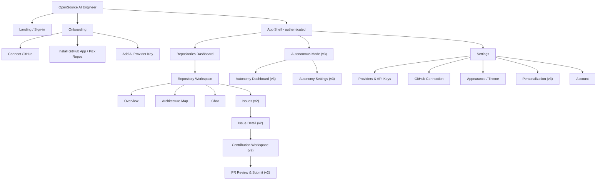

# OpenSource AI Engineer — UI/UX Specification

| | |
|---|---|
| **Product** | OpenSource AI Engineer |
| **Document** | UI/UX Specification |
| **Version** | 0.1 |
| **Date** | 2026-07-15 |
| **Status** | Draft |
| **Owner** | Design |

> A web dashboard where developers connect GitHub, chat with an AI about a repository, explore an interactive architecture map, discover contribution opportunities, review AI-generated code, and approve pull requests. Bring-your-own AI provider. **Mandatory human approval before any PR.**

---

## 1. Overview & Phasing

This spec covers the full product vision but designs the **v1 wedge** in the most detail. Every screen is tagged with its release phase.

| Phase | Theme | Screens |
|-------|-------|---------|
| **v1** | Understand a repo | Landing/Sign-in, GitHub Connect & App Install, Provider/API-key setup, Repository List, Repository Overview, Architecture Map, Repository Chat, Settings |
| **v2** | Contribute to a repo | Issue Discovery Feed, Issue Detail, AI Contribution Workspace, PR Review & Submit |
| **v3** | Autonomy | Autonomous Mode Dashboard + settings, Personalization |

**Design principle for phasing:** v1 must feel complete on its own — a developer can connect, understand a codebase, and chat with it. v2/v3 surfaces are stubbed as "Coming soon" locked nav items in v1 so the growth path is visible but never blocks the core loop.

---

## 2. UX Principles & Design Goals

1. **Clarity over cleverness.** Prefer plain layouts, obvious labels, and predictable behavior over novel interactions. A developer should never wonder "what does this button do."
2. **Trust & transparency for AI actions.** Every AI output that touches code or makes a claim shows *where it came from* (cited files/lines) and *how sure it is* (confidence). No black boxes.
3. **Human-in-control.** The AI proposes; the human disposes. Nothing is pushed, committed, or opened as a PR without an explicit human approval click. This is a hard product rule, reflected in UI everywhere.
4. **Progressive disclosure.** Show the essential first (summary, "start here"), let users drill into detail (file trees, diffs, raw logs) on demand. Avoid wall-of-information screens.
5. **"Explain like I'm a beginner" affordances.** First-time-in-open-source users can toggle beginner explanations (glossary tooltips, "what is this?" links, plain-English summaries) without cluttering the expert view.
6. **Keyboard-friendly for developers.** Command palette (Cmd/Ctrl+K), keyboard shortcuts for navigation and common actions, focus-visible everywhere, no mouse required for the core loop.
7. **Fast perceived performance.** Skeleton loaders, streaming responses, optimistic UI, and honest progress for long jobs (indexing).

---

## 3. Design System Foundations

### 3.1 Component library recommendation

- **Framework:** Next.js (App Router) + React + TypeScript.
- **Styling:** Tailwind CSS with CSS variables for theme tokens.
- **Primitives:** **shadcn/ui** (Radix UI under the hood) for accessible, unstyled-then-themed components — Dialog, DropdownMenu, Tabs, Tooltip, Command (palette), Sheet, Toast, Popover, ScrollArea.
- **Icons:** **Lucide** (`lucide-react`) — consistent 1.5px stroke, matches developer aesthetic.
- **Charts/graph:** `@xyflow/react` (React Flow) for the architecture map; `shiki` for syntax highlighting; `react-diff-view` or `diff2html` for diffs.
- **Markdown:** `react-markdown` + `remark-gfm` for chat and README rendering.

### 3.2 Color palette (dark-mode-first)

Dark is the default. Light is a first-class supported theme. Tokens are semantic, not raw colors.

| Token | Dark | Light | Use |
|-------|------|-------|-----|
| `--bg` | `#0B0E14` | `#FFFFFF` | App background |
| `--bg-subtle` | `#11151F` | `#F7F8FA` | Sidebars, cards |
| `--bg-elevated` | `#161B26` | `#FFFFFF` | Popovers, modals |
| `--border` | `#232A38` | `#E4E7EC` | Dividers, card borders |
| `--fg` | `#E6EAF2` | `#111827` | Primary text |
| `--fg-muted` | `#9AA4B2` | `#6B7280` | Secondary text |
| `--fg-subtle` | `#5B6472` | `#9CA3AF` | Tertiary/hints |
| `--primary` | `#5B8DEF` | `#2563EB` | Primary actions, links |
| `--primary-fg` | `#FFFFFF` | `#FFFFFF` | Text on primary |
| `--success` | `#3FB950` | `#16A34A` | Passing tests, approved |
| `--warning` | `#D29922` | `#CA8A04` | Medium risk, caution |
| `--danger` | `#F85149` | `#DC2626` | Errors, high risk, reject |
| `--accent-ai` | `#A371F7` | `#7C3AED` | AI-generated content marker |

**AI-content convention:** anything authored by the AI carries a subtle `--accent-ai` left-border or a sparkle glyph so users can always distinguish AI output from their own content or from GitHub source of truth.

Semantic status colors double as the **risk scale**: green = low, amber = medium, red = high.

### 3.3 Typography

| Role | Family | Notes |
|------|--------|-------|
| UI / body | System UI stack (`-apple-system, Segoe UI, Roboto, Inter fallback`) | Fast, native feel |
| Code / mono | `ui-monospace, "JetBrains Mono", "SF Mono", Menlo, monospace` | File paths, diffs, code, tokens |
| Numeric (metrics) | mono, tabular-nums | Confidence %, LOC, time estimates |

**Type scale (rem):** `0.75 / 0.8125 / 0.875 / 1 / 1.125 / 1.25 / 1.5 / 1.875 / 2.25`. Body default `0.875rem (14px)`; line-height `1.5`.

### 3.4 Spacing & radius

- **Spacing scale (Tailwind, px):** `2, 4, 8, 12, 16, 20, 24, 32, 40, 48, 64`. Base unit = 4px.
- **Radius:** `sm 4px`, `md 8px` (default cards/buttons), `lg 12px` (modals), `full` (avatars/pills).
- **Shadows:** minimal in dark mode (rely on elevation via `--bg-elevated` + border); soft shadows in light mode.

### 3.5 Theming

- Theme controlled by `class` strategy (`.dark` on `<html>`) with tokens in CSS variables.
- Respect `prefers-color-scheme` on first visit; persist explicit choice in `localStorage` + user settings.
- Three-way toggle: System / Light / Dark.

### 3.6 Core component inventory

Button (primary/secondary/ghost/destructive), IconButton, Input, Textarea, Select, Combobox, Checkbox, Switch, Tabs, Card, Badge/Pill, Avatar, Tooltip, Popover, Dropdown, Dialog/Modal, Sheet (side drawer), Toast, Skeleton, Spinner, ProgressBar, EmptyState, CodeBlock, DiffViewer, FileTree, ChatBubble, CitationChip, ConfidenceMeter, RiskBadge, CommandPalette.

---

## 4. Information Architecture

### 4.1 Navigation tree



### 4.2 URL structure

| Route | Screen | Phase |
|-------|--------|-------|
| `/` | Landing / Sign-in | v1 |
| `/onboarding/github` | Connect GitHub | v1 |
| `/onboarding/install` | Install App / Pick repos | v1 |
| `/onboarding/provider` | Add provider key | v1 |
| `/repos` | Repositories dashboard | v1 |
| `/repos/[owner]/[name]` | Repo Overview | v1 |
| `/repos/[owner]/[name]/map` | Architecture Map | v1 |
| `/repos/[owner]/[name]/chat` | Repository Chat | v1 |
| `/repos/[owner]/[name]/issues` | Issue Discovery Feed | v2 |
| `/repos/[owner]/[name]/issues/[id]` | Issue Detail | v2 |
| `/repos/[owner]/[name]/issues/[id]/work` | Contribution Workspace | v2 |
| `/repos/[owner]/[name]/pr/[id]` | PR Review & Submit | v2 |
| `/autonomous` | Autonomy dashboard | v3 |
| `/settings/*` | Settings tabs | v1 |

---

## 5. Global Navigation & Layout

### 5.1 App shell

```
+----------------------------------------------------------------------+
| TOP BAR                                                              |
| [Logo] Repo switcher v      [ /  Search or Cmd+K ]    [?] [theme] [av]|
+------------+---------------------------------------------------------+
| SIDEBAR    | MAIN CONTENT AREA                                       |
|            |                                                         |
| Repos      |                                                         |
| ─────────  |                                                         |
| Overview   |   (screen-specific content)                            |
| Map        |                                                         |
| Chat       |                                                         |
| Issues 🔒  |                                                         |
|            |                                                         |
| ─────────  |                                                         |
| Autonom.🔒 |                                                         |
| Settings   |                                                         |
+------------+---------------------------------------------------------+
```

- **Top bar (global):** logo/home, **repo switcher** (Command-style dropdown showing recent repos), global search / command palette trigger, help/beginner-mode toggle, theme toggle, account avatar menu.
- **Sidebar (contextual):** when inside a repo, shows the repo's sub-nav (Overview, Map, Chat, Issues[v2]). At the dashboard level, shows global nav (Repositories, Autonomous[v3], Settings). Collapsible to icon-rail (persisted). v2/v3 items show a lock icon + "Coming soon" tooltip in v1.
- **Breadcrumb** under top bar inside a repo: `Repos / owner/name / Chat`.

### 5.2 Command palette (Cmd/Ctrl+K)

Global, powered by shadcn `Command`. Grouped results:
- **Navigate:** jump to any repo, screen, or setting.
- **Actions:** "Ask about this repo", "Open architecture map", "Add provider key", "Switch theme", "Find an issue" (v2).
- **Search:** files within the active repo, past chat threads.

Fuzzy match, arrow-key nav, Enter to execute, Esc to close. Recent commands surface first.

### 5.3 Responsive behavior

| Breakpoint | Layout |
|-----------|--------|
| `≥1280px` (desktop) | Full 3-region shell; multi-pane screens (chat+code, map+detail) side-by-side |
| `768–1279px` (tablet) | Sidebar collapses to icon rail; multi-pane screens stack or use tabs |
| `<768px` (mobile) | Sidebar becomes a slide-in Sheet (hamburger); single-column; code/map panes become full-screen toggles. Read-first experience (see §11) |

---

## 6. Screen-by-Screen Specifications

Legend for states: **E** empty · **L** loading · **Er** error · **S** success.

---

### 6a. Landing / Sign-in — *v1*

**Purpose:** Communicate value in one glance and get the developer authenticated with GitHub.

**Layout:** Centered hero, single primary CTA, minimal chrome. Marketing rows below the fold (optional). No dense nav.

**Key components:** Hero headline + subhead, "Continue with GitHub" OAuth button, trust strip ("Human approval required for every PR · Your API keys, your models"), theme toggle, footer links.

**Primary actions:** Sign in with GitHub.

**States:**
- **E/S:** Static hero.
- **L:** OAuth button shows spinner + "Redirecting to GitHub…".
- **Er:** OAuth failure banner with retry and a plain-English reason.

```
+--------------------------------------------------------------+
|                                              [theme]         |
|                                                              |
|            Understand any codebase. Contribute              |
|            with confidence.                                 |
|                                                              |
|   Chat with a repo, see its architecture, and let AI        |
|   draft PRs — that you always approve.                      |
|                                                              |
|            [  Continue with GitHub  ]                        |
|                                                              |
|   ✓ Human approval on every PR   ✓ Bring your own AI keys    |
|                                                              |
+--------------------------------------------------------------+
```

---

### 6b. GitHub Connect & App Install Onboarding — *v1*

**Purpose:** Move from OAuth identity → installed GitHub App → selected repositories the AI is allowed to read. This is a 3-step wizard (steps b, then repo pick, then c).

**Layout:** Left rail step indicator (1 Connect · 2 Repos · 3 AI Key), main panel per step, persistent "why we ask" explainer.

**Key components:** Stepper, permission-scope explainer card (read-only vs write clarified), "Install GitHub App" button (opens GitHub in new tab), repo picker (searchable multi-select list synced from the installation), "All repos vs Selected repos" note mirroring GitHub's own choice.

**Primary actions:** Install App (external), Sync repos, Select repos, Continue.

**States:**
- **E:** No installation yet → "Install the GitHub App to grant access." with prominent button.
- **L:** "Waiting for installation…" polling state after returning from GitHub; skeleton repo list.
- **Er:** Installation not detected → "We couldn't find an installation. Re-install or check org permissions." + retry.
- **S:** Repos listed with checkboxes; selected count shown; Continue enabled once ≥1 selected.

```
+-------------+------------------------------------------------+
| ① Connect   |  Install the OpenSource AI Engineer app        |
| ● Repos     |                                                |
| ○ AI Key    |  We request READ access to the repos you pick. |
|             |  We never write without your explicit approval.|
|             |                                                |
|             |   [ Install GitHub App ↗ ]                     |
|             |  ------------------------------------------    |
|             |  Search repos:  [__________________]           |
|             |  [x] acme/web-app        JS   ⭐ 1.2k           |
|             |  [x] acme/api            Go   ⭐ 340            |
|             |  [ ] acme/docs           MD                     |
|             |                                                |
|             |  2 selected            [ Continue → ]          |
+-------------+------------------------------------------------+
```

---

### 6c. Provider / API-Key Setup — *v1*

**Purpose:** Let users bring their own AI provider and validate the key before use. BYO-provider is core; costs and control stay with the user.

**Layout:** Provider cards/grid (Anthropic, OpenAI, Google, OpenRouter, Local/Custom endpoint), selected provider expands to key input + model select.

**Key components:** Provider selector, masked API-key input (with show/hide), "Test key" button (calls a lightweight validation), default-model dropdown, per-repo override note, security reassurance ("Keys are encrypted at rest and never sent to our servers in plaintext / stored client-side per your architecture").

**Primary actions:** Save & test key, Set default model, Continue / Finish onboarding.

**States:**
- **E:** No provider configured → guidance + "Add your first provider."
- **L:** "Testing key…" spinner on Test.
- **Er:** Invalid key → inline red "Key rejected by <provider> (401). Check the value." Never echo the key back in error text.
- **S:** Green "Key valid · <model> ready" badge; provider marked Active.

> **Security note (spec-level):** The UI must never place API keys in URLs, logs, or analytics. Keys are entered into a password-type field, masked, and submitted over the credential path only. Claude does not auto-fill or transmit keys to any endpoint not chosen by the user.

```
+--------------------------------------------------------------+
|  Add an AI provider                                          |
|  [ Anthropic ] [ OpenAI ] [ Google ] [ OpenRouter ] [ Custom]|
|  ---------------------------------------------------------   |
|  API Key   [ ••••••••••••••••••••  ] [👁]   [ Test key ]     |
|  Default model  [ claude-… ▼ ]                              |
|                                                              |
|  🔒 Your key is encrypted and used only for your requests.   |
|                                        [ Save & Finish → ]    |
+--------------------------------------------------------------+
```

---

### 6d. Repository List / Dashboard — *v1*

**Purpose:** Home base after onboarding. See connected repos, their index status, and jump in.

**Layout:** Grid or list of repo cards; filter/search bar; "Add repos" affordance. Index status is front and center.

**Key components:** Repo card (name, owner avatar, primary language chip, stars, last indexed, **index status**), search/filter, sort (recent/name/stars), "Add repositories" button (re-opens repo picker), status legend.

**Primary actions:** Open repo, Add repos, Re-index, Search/filter.

**States:**
- **E:** No repos connected → EmptyState with illustration + "Connect a repository to begin" → onboarding.
- **L:** Skeleton cards.
- **Er:** Failed to load repo list → retry banner.
- **S:** Cards render; repos still indexing show a progress pill and are openable but flagged "Indexing — chat may be partial."

```
+--------------------------------------------------------------+
|  Repositories            [ + Add repos ]   [ search… ]  sort v|
|  --------------------------------------------------------    |
|  +------------------+  +------------------+  +--------------+ |
|  | acme/web-app     |  | acme/api         |  | acme/docs    | |
|  | JS · ⭐1.2k       |  | Go · ⭐340        |  | MD           | |
|  | ✅ Indexed 2h ago |  | ⏳ Indexing 62%   |  | ✅ Indexed    | |
|  | [ Open ]         |  | [ Open ]         |  | [ Open ]     | |
|  +------------------+  +------------------+  +--------------+ |
+--------------------------------------------------------------+
```

---

### 6e. Repository Overview — *v1*

**Purpose:** The "know this repo in 60 seconds" screen. AI-summarized README, language mix, key modules, and a "Start here" path.

**Layout:** Two-column. Left: AI summary + "Start here" + key modules. Right: metadata (languages bar, stars/forks/issues, license, activity). Tabs or sidebar to Map/Chat.

**Key components:**
- **AI README summary** (marked as AI-generated, with a "based on README + code" citation).
- **Languages bar** (stacked % by language).
- **Key modules list** (top directories/packages with one-line purpose each).
- **"Start here" card:** ranked entry points for a newcomer (e.g., `src/index.ts`, `README#getting-started`, main service).
- Quick actions: "Ask a question", "View architecture map".

**Primary actions:** Ask about this repo (→ Chat), Open architecture map, Open a key module in code viewer.

**States:**
- **E:** Repo just added → "Indexing this repo… overview will appear when ready" with progress.
- **L:** Skeleton summary + shimmer bars.
- **Er:** Index failed → "We couldn't index this repo. Retry / check permissions."
- **S:** Full overview; beginner-mode adds glossary tooltips on jargon.

```
+---------------------------+----------------------------------+
| ✨ Summary (AI)            |  Languages                       |
| A TypeScript web app that |  ▓▓▓▓▓▓ TS 68%  ▓▓ CSS 20% ...    |
| ... [cited: README, src/] |  ⭐1.2k  ⑂210  ◍ 34 issues        |
|                           |  License: MIT                    |
| ▶ Start here              |                                  |
|  1. src/app/page.tsx      |  Key modules                     |
|  2. README#getting-started|  • src/app  — routes & pages     |
|  3. src/lib/api.ts        |  • src/lib  — data & api client  |
|                           |  • src/components — UI           |
| [ Ask about this repo ]   |  [ View architecture map → ]     |
+---------------------------+----------------------------------+
```

---

### 6f. Interactive Architecture Map — *v1*

**Purpose:** Visualize the repo's structure and layering so a developer can grasp how modules relate, click to expand, and jump to code or chat.

**Layout:** Full-canvas graph (React Flow) with a controls rail (zoom, fit, layout, layer filter) and a right-side detail drawer that opens on node click.

**Key components:**
- **Nodes = modules/packages/layers.** Color-coded by architectural layer (e.g., UI / Domain / Application / Infrastructure / External) to communicate clean-architecture layering. A legend maps colors → layers.
- **Edges = dependencies** (directional arrows). Highlight incoming/outgoing on hover.
- **Clustering:** collapsible groups; click a node to expand into its children (files/submodules).
- **Detail drawer:** on select — module purpose (AI, cited), files, dependencies in/out, "Open in chat", "Open code."
- Controls: layout (layered/force/tree), layer visibility toggles, search-to-focus a node, minimap.

**Primary actions:** Click node → detail; Expand/collapse; Filter by layer; "Explain this module" (→ Chat prefilled); Open file.

**States:**
- **E:** Not enough structure detected → "This repo is small — here's a flat view."
- **L:** "Building the map…" with skeleton graph.
- **Er:** Map generation failed → retry; fallback to a plain module list.
- **S:** Interactive graph; selected node highlighted with dimmed neighbors.

```
+-----------------------------------------------+-------------+
| [fit][+/-] Layers: [UI][App][Domain][Infra]   | �स Module    |
|                                               | src/lib/api |
|   ( UI )────▶( App )────▶( Domain )           | Layer: App  |
|      │            │           ▲               | ✨ Handles   |
|      ▼            ▼           │               | HTTP calls…  |
|   (Components)  (api)────▶(Infra: db)         | [cited files]|
|                                               | In: 4  Out:2 |
|   legend: ■UI ■App ■Domain ■Infra ■External   | [Open chat]  |
|                                    [minimap]  | [Open code]  |
+-----------------------------------------------+-------------+
```

---

### 6g. Repository Chat — *v1* (flagship screen)

**Purpose:** Ask questions about the repo and get answers grounded in the actual code, with cited files and an adjacent code viewer.

**Layout:** Two-pane. Left: chat thread + composer. Right: **code/source viewer** that opens to the file/line a citation points to. Collapsible thread list. On narrow screens, code viewer becomes a toggle/overlay.

**Key components:**
- **Chat thread:** user + AI bubbles. AI bubbles carry the `--accent-ai` marker.
- **Citation chips:** inline `[src/lib/api.ts:42]` chips under/within an answer; clicking scrolls the right pane to that file and highlights lines.
- **Streaming indicator:** token-by-token streaming with a "thinking / reading files" status showing which files the AI is currently consulting.
- **Code viewer:** syntax-highlighted (shiki), file breadcrumb, line highlight for cited ranges, "open on GitHub" link.
- **Composer:** multiline input, file-mention `@path` autocomplete, model indicator, send (Enter) / newline (Shift+Enter), stop-generation button.
- **Thread management:** new chat, rename, history.

**Primary actions:** Send message, Stop generation, Click citation → open file, New thread, Copy answer/code.

**States:**
- **E:** New thread → suggested starter prompts ("What does this repo do?", "Where is auth handled?", "How do I run it?").
- **L:** Streaming answer with live status; skeleton for code pane until a citation is clicked.
- **Er:** Provider error (rate limit / invalid key) → inline retry with plain reason; "Fix key in Settings" deep link. Indexing-incomplete → banner "Answers may be partial while indexing (62%)."
- **S:** Answer with citations; code pane synced.

```
+-----------------------------+------------------------------+
| ▸ Threads   [+ New]         |  src/lib/api.ts        [↗gh]  |
| ───────────────────────     |  40  export async function…  |
| You: Where is auth handled? |  41  const res = await fetch |
|                             |  42 ▓ if (!res.ok) throw …   |
| ✨ Auth lives in src/lib/    |  43    return res.json()     |
|    auth.ts. The middleware  |                              |
|    checks the session…      |                              |
|    Sources: [auth.ts:12]    |                              |
|    [middleware.ts:8]        |                              |
|    ● reading 3 files…       |                              |
| ─────────────────────────   |                              |
| [ Ask about this repo…   ▷] |                              |
+-----------------------------+------------------------------+
```

---

### 6h. Issue Discovery Feed — *v2*

**Purpose:** Surface contribution opportunities (good-first-issues, bugs, feature requests) ranked and filterable, so a developer can find something worth doing.

**Layout:** Filter/sort bar + feed of issue cards; optional right rail of saved/recommended.

**Key components:** Issue card (title, labels, repo, AI complexity/time/risk badges, "good first issue" flag), filters (label, difficulty, language, estimated time), sort (recommended/newest/easiest), "Analyze" and "Start contribution" actions.

**Primary actions:** Open issue detail, Filter/sort, Start a contribution.

**States:** E: "No open issues match — widen filters." · L: skeleton cards · Er: fetch failure retry · S: ranked feed.

```
+--------------------------------------------------------------+
| Issues  [ label ▾ ][ difficulty ▾ ][ ~time ▾ ]   sort:Rec ▾  |
| ------------------------------------------------------------ |
| #128 Fix flaky login test      good-first-issue  🟢 Low  ~1h |
| #131 Add pagination to /users  enhancement       🟡 Med  ~3h |
| #140 Refactor auth middleware  bug                🔴 High ~1d |
+--------------------------------------------------------------+
```

---

### 6i. Issue Detail with Complexity Analysis — *v2*

**Purpose:** Give a decision-ready read on a single issue: what it is, related code, and AI-estimated complexity / time / risk.

**Layout:** Two-column. Left: issue body + discussion. Right: **AI analysis panel** (complexity, time estimate, risk, affected files, suggested approach).

**Key components:** Issue header (title, state, labels), rendered issue body, **analysis card** with complexity/time/risk meters and cited affected files, "Suggested approach" (AI, cited), CTA "Start AI contribution."

**Primary actions:** Start AI contribution (→ Workspace), Ask about this issue (→ Chat), View affected files.

**States:** E: no analysis yet → "Analyze this issue" button. · L: "Analyzing…" · Er: retry · S: full analysis; low-confidence analysis is flagged.

```
+-----------------------------+------------------------------+
| #131 Add pagination         |  ✨ AI Analysis               |
| Labels: enhancement         |  Complexity ▓▓▓░░ Medium      |
|                             |  Est. time   ~3h             |
| Body: Users endpoint returns|  Risk        🟡 Medium        |
| all rows; we need paging…   |  Affected: routes/users.ts,  |
|                             |            lib/db.ts [cited] |
|                             |  Approach: add limit/offset… |
| [ Ask about this issue ]    |  [ Start AI contribution → ] |
+-----------------------------+------------------------------+
```

---

### 6j. AI Contribution Workspace — *v2* (trust-critical)

**Purpose:** The place where AI does work under human control: shows a **plan**, generated **file diffs**, **test results**, a **confidence score**, and the **approve/reject** gate. Nothing leaves this screen without approval.

**Layout:** Three regions. Top: plan/steps + status. Center: **diff viewer** with file list (left) and per-file diff (right). Bottom/right rail: **test results** + **confidence** + **approval bar**.

**Key components:**
- **Plan panel:** ordered steps the AI intends/executed, each with status (done/running/failed) and a short rationale.
- **Diff viewer:** file tree with add/mod/del counts; unified or split diff; per-file collapse; syntax highlight; comment/annotate.
- **Test results:** command output summarized (X passed / Y failed), expandable raw logs, pass/fail badge.
- **Confidence score:** a `ConfidenceMeter` (0–100%) with a "why" tooltip listing the factors (test coverage, diff size, unfamiliar files).
- **Risk callouts:** flags for risky changes (touches auth, deletes files, migrations).
- **Approval bar (sticky):** `Approve → create PR`, `Request changes`, `Reject/discard`. Approve is the only path to a PR and is visually distinct + requires the diff to have been viewed.

**Primary actions:** Run/re-run tests, Approve → PR, Request changes (feedback loop to AI), Reject, Comment on a line, Edit a hunk.

**States:**
- **E:** Fresh → "AI is planning…"
- **L:** Streaming plan; diffs appear as generated; tests "Running…"
- **Er:** Generation/test failure → clear failure with logs; "Retry" / "Ask AI to fix."
- **S:** Complete plan, diffs, passing tests, confidence shown; approval bar enabled.

```
+--------------------------------------------------------------+
| Plan  ✅1 Read code  ✅2 Edit users.ts  ✅3 Add tests  ●4 Run  |
+------------------+-------------------------------------------+
| Files            |  routes/users.ts                          |
| ~ users.ts  +18-2|  - return all(users)                      |
| + users.test +40 |  + return paginate(users, limit, offset)  |
|                  |                                           |
+------------------+-------------------------------------------+
| Tests: ✅ 24 passed  ❌ 0 failed   [view logs]                |
| Confidence: ▓▓▓▓▓▓▓▓░░ 82%  (i why)   Risk: 🟡 touches API    |
| ─────────────────────────────────────────────────────────── |
| [ Reject ]      [ Request changes ]     [ ✅ Approve → PR ]   |
+--------------------------------------------------------------+
```

> **Guardrail UI:** Until "Approve → PR" is clicked, a persistent banner reads *"Nothing has been pushed. This is a local proposal."* Approve triggers a final confirm modal summarizing: target branch, PR title, files changed, test status.

---

### 6k. PR Review & Submit — *v2*

**Purpose:** Compose the pull request the human approved and confirm submission to GitHub.

**Layout:** Left: PR metadata form (title, description, target branch, labels). Right: final diff + checklist summary.

**Key components:** Editable AI-drafted PR title/description (marked AI-drafted), target branch selector, linked issue, final change summary, test/confidence recap, "Create Pull Request" button, "Save as draft PR" option.

**Primary actions:** Edit title/body, Select branch, **Create PR** (explicit, side-effectful → confirm), Save draft, Back to workspace.

**States:** E: n/a (reached post-approval). · L: "Creating PR…" · Er: GitHub API error (permissions/conflict) with retry & guidance. · S: "PR #142 opened" with link to GitHub and status.

```
+-----------------------------+------------------------------+
| Title  [ Add pagination…  ] |  Summary                     |
| Base   [ main ▾ ]           |  2 files changed  +58 −2     |
| Links  Closes #131          |  ✅ 24 tests passed           |
| ✨ Description (editable)     |  Confidence 82%              |
|  Adds limit/offset paging…  |                              |
|                             |  ⚠ Creating a PR pushes a    |
| [ Save draft ]              |    branch to GitHub.         |
|                             |  [ Create Pull Request → ]   |
+-----------------------------+------------------------------+
```

---

### 6l. Autonomous Mode Dashboard + Settings — *v3*

**Purpose:** For trusted repos, let the AI work more independently within strict, user-defined bounds — while preserving the human-approval gate for PRs by default.

**Layout:** Dashboard of autonomous "runs" (queue/active/completed) + a settings panel of guardrails.

**Key components:**
- **Runs board:** each autonomous task with status, target issue, confidence, and whether it's **awaiting approval** (default) or auto-approved (only if the user explicitly enabled a bounded auto-approve policy).
- **Guardrail settings:** which repos, which issue types, max risk allowed, "always require approval" master switch (on by default), spending/rate caps per provider, quiet hours.
- **Activity log / audit trail:** every action with timestamp and cited change.

**Primary actions:** Enable/disable autonomy per repo, Set guardrails, Approve queued items in bulk (still explicit), Pause all.

**States:** E: "Autonomous mode is off." · L: loading runs · Er: run failure surfaced · S: live board.

> Even in v3, the default and recommended posture keeps **mandatory human approval before any PR**. Any auto-approve path is opt-in, bounded (risk/label/repo scoped), and reversible, with a prominent global "Pause all autonomy" control.

```
+--------------------------------------------------------------+
| Autonomous Mode           [ ⏸ Pause all ]   master approval:ON|
| ------------------------------------------------------------ |
| Active                                                       |
| • acme/api #131  drafting…      conf — awaiting              |
| Awaiting approval                                            |
| • acme/web #128  ready  82%     [ Review ] [ Approve ]       |
| Completed                                                    |
| • acme/api #140  PR #142 opened ✅                            |
+--------------------------------------------------------------+
```

---

### 6m. Settings / Personalization — *v1 (core) / v3 (personalization)*

**Purpose:** Manage providers/keys, GitHub connection, appearance, account, and (v3) personalization.

**Layout:** Left settings nav; right content pane per tab.

**Tabs & components:**
- **Providers & API Keys (v1):** list of providers, add/remove, test, default model, per-repo overrides, usage caps.
- **GitHub Connection (v1):** installation status, connected repos, manage on GitHub, disconnect.
- **Appearance (v1):** theme (System/Light/Dark), density, beginner-mode default, code font size.
- **Account (v1):** profile, sessions, delete account (destructive → confirm; actual deletion performed by the user through explicit confirmation, never silently).
- **Personalization (v3):** experience level (beginner↔expert) tuning default verbosity of explanations, preferred languages/frameworks, notification prefs.

**States:** standard form states; save shows toast; destructive actions require typed confirmation.

```
+-------------+------------------------------------------------+
| Providers   |  Providers & API Keys                          |
| GitHub      |  Anthropic  ● Active  claude-…   [Test][Edit]   |
| Appearance  |  OpenAI     ○         [ + Add key ]             |
| Account     |  Default model: claude-…                       |
| Personaliz. |  Monthly cap: [ $50 ]                           |
+-------------+------------------------------------------------+
```

---

## 7. Key Interaction Flows

### Flow 1 — Onboarding (v1)
1. Landing → **Continue with GitHub** → OAuth (L: redirecting).
2. Return authed → `/onboarding/github` → **Install GitHub App** (opens GitHub ↗).
3. Return → polling (L: "Waiting for installation…") → installation detected → repo picker.
4. Select ≥1 repo → **Continue** → `/onboarding/provider`.
5. Choose provider → enter key → **Test key** (L → S green / Er red).
6. **Finish** → `/repos`. Selected repos begin indexing (progress pills).

### Flow 2 — Ask a question about a repo (v1)
1. `/repos` → open repo → **Overview**.
2. Click **Ask about this repo** → `/…/chat` (E: starter prompts).
3. Type question → Enter → AI streams (L: "reading 3 files…").
4. Answer renders with **citation chips**.
5. Click a citation → right **code pane** scrolls to file + highlights lines (S).
6. Follow-up questions continue the thread.

### Flow 3 — Explore architecture (v1)
1. Repo → **Map** (L: "Building the map…").
2. Layered graph renders; use **layer filters** to isolate Domain/Infra.
3. Click a node → **detail drawer** (purpose + cited files + deps).
4. Click **Explain this module** → Chat opens prefilled → grounded answer.
5. Or **Open code** → code viewer for that module.

### Flow 4 — Discover & start an issue (v2)
1. Repo → **Issues** feed → filter by difficulty "Low" (S: ranked).
2. Open issue → **Issue Detail** → **Analyze** (L → S: complexity/time/risk).
3. **Start AI contribution** → **Contribution Workspace**.
4. AI streams **plan** → **diffs** → runs **tests** (L each).
5. Review diffs, read confidence + risk.

### Flow 5 — Review & approve a PR (v2)
1. In Workspace, review all diffs (approval bar stays disabled until diff viewed).
2. Optionally **Request changes** → AI revises (loop) → re-test.
3. **Approve → PR** → confirm modal (branch, title, files, tests) → confirm.
4. **PR Review & Submit** → edit title/body/base → **Create Pull Request** (side-effectful; explicit).
5. S: "PR #142 opened" + GitHub link. Nothing was pushed before step 3–4.

---

## 8. AI Transparency & Trust Patterns

| Pattern | How it appears |
|---------|----------------|
| **Source citations** | Every factual/code answer includes clickable citation chips `[path:line]` that open the exact file+lines in the code viewer. Answers without sufficient grounding say so. |
| **AI-authored marker** | All AI-generated content (summaries, plans, PR descriptions, diffs) carries the `--accent-ai` accent + sparkle glyph, distinct from GitHub source-of-truth and user text. |
| **Confidence scores** | `ConfidenceMeter` (0–100%) on analyses and contributions, with an "i / why" tooltip enumerating contributing factors (test results, diff size, unfamiliar code, citation coverage). Low confidence is never hidden. |
| **Risk presentation** | `RiskBadge` (green/amber/red) with reasons ("touches auth", "DB migration", "deletes files"). High-risk changes get an inline callout above the diff. |
| **Diffs before approval** | No change is describable as "applied" until approved. Diffs are shown in full with add/del counts; the approve control is disabled until the diff has been viewed. |
| **Streaming / thinking** | Token streaming plus an explicit status line ("reading 3 files…", "running tests…") so the user sees the AI's current activity, not a frozen spinner. |
| **"Nothing pushed" guarantee** | A persistent banner in the Workspace states nothing is pushed pre-approval; the approve action opens a confirm modal; PR creation is a separate, explicit, side-effectful step. |
| **Auditability** | Contribution and (v3) autonomous actions have a timestamped activity log linking to the exact changes. |

---

## 9. Empty / Loading / Error States (Global Patterns)

- **Skeletons** for structured content (cards, overview, diffs); **spinners** only for short indeterminate waits.
- **Indexing-in-progress (major pattern):** Repos take time to index. Show a **progress bar/pill with %** on the repo card, Overview, and a chat banner ("Answers may be partial while indexing — 62%"). Screens remain usable in a degraded, clearly-labeled mode; a toast fires on completion.
- **Empty states** always pair a one-line explanation with a single primary action (e.g., "No repos yet → Connect a repository").
- **Errors** are plain-English, blame the situation not the user, name the cause when known (provider 401, GitHub permissions, network), and offer **Retry** plus a deep link to the fix (e.g., "Update key in Settings").
- **Provider/key errors** never echo the key; **rate-limit** errors show suggested wait.
- **Optimistic UI** for reversible actions (rename thread), with rollback + toast on failure.

| Situation | State shown |
|-----------|-------------|
| Repo indexing | Progress % everywhere it's relevant; degraded-but-usable |
| No provider key | Blocking prompt on first AI action → deep link to Settings |
| Provider 401/429 | Inline error, retry, "fix key" link, wait hint |
| GitHub perms missing | Banner + "Manage on GitHub ↗" |
| Test run failed (v2) | Fail badge + expandable logs + "Ask AI to fix" |

---

## 10. Accessibility (WCAG 2.1 AA)

- **Contrast:** All text meets AA (≥4.5:1 body, ≥3:1 large/UI). Status colors are validated in both themes and never the sole signal — always paired with icon/label (e.g., risk = color + text + icon).
- **Keyboard:** Full keyboard operability. Command palette (Cmd/Ctrl+K), logical tab order, visible `focus-visible` rings, no keyboard traps, Esc closes overlays, arrow-key nav in lists/menus/graph.
- **Screen readers:** Semantic landmarks (`nav`, `main`, `aside`), ARIA labels on icon-only buttons, `aria-live="polite"` for streaming answers and toasts, `aria-busy` during loading, diff regions labeled with file + change counts.
- **Focus management:** On modal open, focus moves in and is trapped; on close, returns to trigger. Route changes move focus to the main heading.
- **Motion:** Respect `prefers-reduced-motion` — disable graph auto-animations and streaming cursor pulse.
- **Forms:** Labels tied to inputs, error text linked via `aria-describedby`, required fields announced.
- **Targets:** Minimum 44×44px touch targets on interactive controls.
- **The architecture map** provides a text/list fallback view for non-visual users (keyboard-navigable node list with the same relationships).

---

## 11. Responsive & Mobile Considerations

- **Desktop-first** product (it's a developer tool), but read paths must work on mobile.
- **Sidebar → Sheet** on mobile via hamburger; top bar keeps repo switcher + command trigger.
- **Two-pane screens** (Chat, Map, Workspace) collapse to a single column with a **toggle** between panes (e.g., Chat ⇄ Code; Map ⇄ Detail). Diffs use unified (not split) view on narrow screens.
- **Architecture map** on mobile: pinch-zoom/pan; tap node → full-screen detail sheet; layer filter in a bottom sheet.
- **Chat composer** sticks to bottom, respects safe-area insets; Enter sends, with an explicit send button for touch.
- **Approval actions (v2)** remain full-width, thumb-reachable, and still require the confirm modal.
- **Not optimized for mobile authoring:** heavy diff review and PR creation are supported but nudge toward desktop with a gentle notice.

---

## 12. Microcopy & Tone Guidelines

**Voice:** A knowledgeable, encouraging senior engineer who mentors without condescension. Precise for experts, warm for beginners. Never hypey about the AI; always honest about limits.

**Principles**
- **Plain, active, specific.** "We couldn't reach GitHub. Retry." not "An error has occurred."
- **Beginner mode** adds context and glossary tooltips ("A *diff* shows what changed"). Expert mode stays terse.
- **Encouraging on contribution:** "Nice — this is a good first issue. Here's the plan." Avoid pressure.
- **Honest about AI:** attribute AI output ("AI summary"), show confidence, never imply certainty it doesn't have.
- **Safety-forward on side effects:** always name the consequence before an irreversible action ("This opens a pull request on GitHub").
- **No blame, no jargon-shaming.** Errors describe the situation and the fix.

| Context | Copy example |
|---------|--------------|
| Indexing | "Getting to know this repo… 62% indexed. You can start chatting — answers may be partial." |
| Empty chat | "Ask me anything about this repo. Try: *Where is auth handled?*" |
| Confidence | "82% confident — based on passing tests and small, well-covered changes." |
| Pre-PR guardrail | "Nothing has been pushed yet. This is a local proposal you can approve or reject." |
| Approve confirm | "Open a pull request to `main`? This pushes a branch to GitHub." |
| Provider error | "Your Anthropic key was rejected (401). Update it in Settings → Providers." |
| Reject | "Discarded. No changes were made to the repo." |

---

## 13. Open Questions

1. **Key storage model:** Are BYO API keys stored server-side (encrypted) or kept client-side only? This changes the Provider screen's security copy and the request architecture. (Spec currently says "encrypted, used only for your requests.")
2. **Indexing engine & limits:** What's the max repo size / language coverage for indexing, and expected index time? Drives the indexing-progress UX and any "too large" empty state.
3. **Monorepo handling:** How does the architecture map and "key modules" behave for very large monorepos? Do we scope by package?
4. **Multi-provider defaults:** Can users set per-repo or per-task models (e.g., cheap model for chat, stronger for contributions)? Affects Settings and per-screen model indicators.
5. **Test execution environment (v2):** Where do tests run (sandbox/CI/user infra)? Impacts test-results UX, timeouts, and security messaging.
6. **Branch/PR conventions:** Do we auto-name branches, respect repo templates/CONTRIBUTING.md, and require CLA checks? Affects PR Review screen.
7. **Autonomous auto-approve scope (v3):** Exactly which bounded conditions may skip manual PR approval, and how do we make the audit trail sufficient? Needs legal/trust review.
8. **Collaboration:** Is this single-user or team/org-shared (shared repos, shared threads, roles/permissions)? Affects IA and settings.
9. **Cost visibility:** Do we show per-request/token cost estimates given BYO keys? Where (composer, workspace, settings caps)?
10. **Beginner vs expert default:** Do we detect experience level or ask during onboarding? Drives Personalization (v3) and default verbosity.

---

*End of document — v0.1 Draft.*
